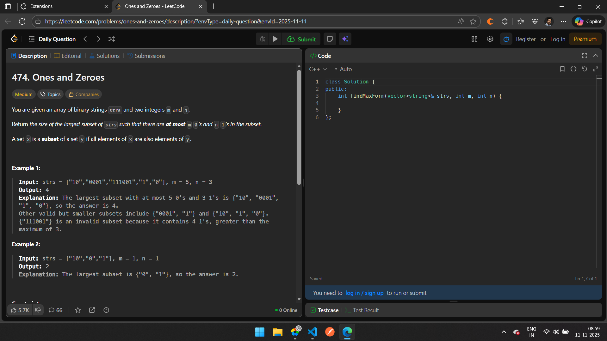
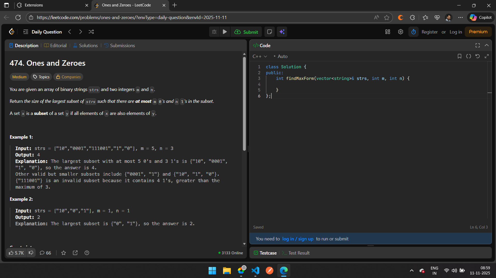
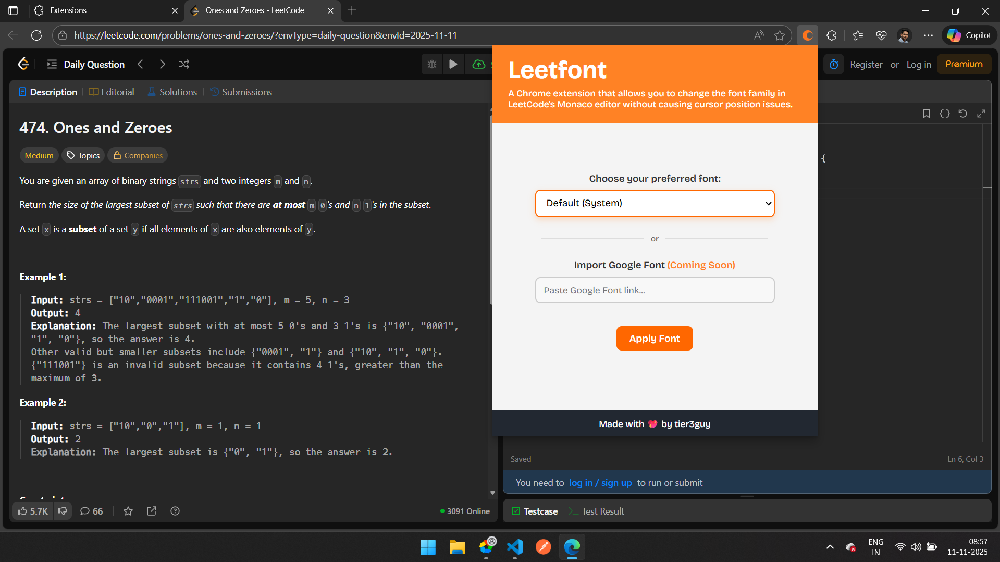

<div align="center">
  
<a href="https://chromewebstore.google.com/detail/mlgcallpmpnghedhljlbkjelocmmdoei">

</a>

<p></p>

**A Chrome extension that lets you change LeetCode’s coding font — without breaking the cursor alignment.**

<p>
  <a href="https://chromewebstore.google.com/detail/mlgcallpmpnghedhljlbkjelocmmdoei">
    
  </a>
  <!-- 
   -->
</p>

🎨 **10+ Popular Fonts** · ⚡ **Instant Apply** · 💾 **Persistent Sync** · 🎯 **Zero Cursor Drift**

</div>

---

## 🌈 Preview

### 🧠 Before — Default LeetCode Editor
> The classic Monaco font — functional but bland.



### ✨ After — With LeetFont
> Instantly upgrade your coding experience with fonts like **JetBrains Mono**, **Fira Code**, and **Cascadia Code**.



---

## 🚀 Quick Install

### 🧩 From Chrome Web Store  
> Click below to install directly from the Chrome Web Store:

<p align="center">
  <a href="https://chromewebstore.google.com/detail/mlgcallpmpnghedhljlbkjelocmmdoei">
    
  </a>
</p>

### 🧰 Manual Installation (Developer Mode)

1. **Clone or Download**

   ```bash
      git clone https://github.com/avinashgupta10/LeetFont.git
   ```

2. **Open Extensions**

   * Visit `chrome://extensions/`
   * Enable **Developer mode**

3. **Load Unpacked**

   * Click **Load unpacked**
   * Select your `LeetFont` folder

4. **Pin the Extension**

   * Click 🧩 icon → Pin **LeetFont**

---

## 💡 Features

| 🌟 Feature                      | 🧩 Description                                                 |
| ------------------------------- | -------------------------------------------------------------- |
| 🎨 **10+ Coding Fonts**         | Choose from Fira Code, JetBrains Mono, Cascadia Code, and more |
| 🎯 **Perfect Cursor Alignment** | Font changes won’t mess up Monaco’s cursor                     |
| ⚡ **Instant Apply**             | No need to refresh — changes apply immediately                |
| 💾 **Persistent Sync**          | Saved preferences sync across Chrome devices                   |
| 🧼 **Minimal UI**               | No clutter, just a clean font picker                           |
| 🔒 **Privacy First**            | Runs only on `leetcode.com`, no tracking or analytics          |

---

## 🖋️ Available Fonts

All fonts marked with 📦 are auto-loaded from **Google Fonts** — no manual setup needed.

| Font               | Type        | Notes                             |
| ------------------ | ----------- | --------------------------------- |
| Default            | System      | LeetCode’s Monaco font            |
| Fira Code 📦       | Google Font | With ligatures                    |
| JetBrains Mono 📦  | Google Font | Developer-friendly                |
| Cascadia Code      | System      | Microsoft’s modern monospace font |
| Source Code Pro 📦 | Google Font | Clean and sharp                   |
| Consolas           | System      | Classic Windows monospace font    |
| Ubuntu Mono 📦     | Google Font | Lightweight and readable          |
| Roboto Mono 📦     | Google Font | Google’s clean monospace          |
| Courier New        | System      | Vintage style                     |
| Monaco             | System      | macOS legacy monospace font       |

---

## 🪄 Usage

1. Open [leetcode.com](https://leetcode.com)
2. Go to any coding problem
3. Click the **LeetFont** icon in the toolbar
4. Select your favorite font
5. 🎉 Instantly applied & saved!

---

## 🧠 How It Works

LeetFont updates only the **font-family** property of Monaco Editor via injected CSS — keeping the editor’s layout and cursor calculations intact.

* ✅ Monospace-only fonts
* ✅ No `font-size` or `line-height` modifications
* ✅ Safe CSS overrides with `!important`
* ✅ Preserves all Monaco editor internals

---

## 🗂️ File Structure

```
LeetFont/
├── assets/
│   ├── after.png           # After applying LeetFont (preview)
│   ├── before.png          # Default LeetCode editor
│   ├── extension.png       # Screenshot of popup / extension window
│   ├── logo.png            # Main logo
│   └── preview.png         # Combined showcase image
│
├── icons/
│   ├── icon16.png          # Browser toolbar icon (16x16)
│   ├── icon32.png          # Context menu icon (32x32)
│   ├── icon48.png          # Extension page icon (48x48)
│   └── icon128.png         # Chrome Web Store / large display icon
│
├── popup/
│   ├── fonts.css           # Google Fonts imports
│   ├── index.css           # Popup styling
│   ├── index.html          # Popup UI
│   └── index.js            # Popup functionality
│
├── content.js              # Script injected into LeetCode pages
├── injected.js             # Script for Monaco editor access
├── manifest.json           # Chrome extension manifest (v3)
├── PRIVACY_POLICY.md       # Privacy disclosure
└── README.md               # Documentation
```

---

## 🧩 Permissions

* **storage** → Save your font choice
* **activeTab** → Apply fonts to the active tab
* **host_permissions** → Restricted to `leetcode.com` only

---

## 🧰 Troubleshooting

**Font not applying?**

* Refresh the LeetCode page
* Make sure you're on a problem page
* Try switching back to “Default” first

**Cursor still misaligned?**

* Hard refresh (`Ctrl + Shift + R`)
* Clear cache and reload

**Extension not visible?**

* Enable it under `chrome://extensions/`
* Pin it from Chrome’s toolbar

---

## 🌍 Browser Compatibility

| Browser            | Status                                 |
| ------------------ | -------------------------------------- |
| 🟢 Chrome          | ✅ Fully Supported                      |
| 🟢 Edge (Chromium) | ✅ Fully Supported                      |
| 🟢 Brave           | ✅ Fully Supported                      |
| 🟠 Opera           | ⚠️ Untested but likely supported       |
| 🔴 Firefox         | ❌ Not supported (Manifest V2 required) |

---

## 🔐 Privacy

LeetFont respects your privacy completely:

* ✅ Runs **only** on `leetcode.com`
* ✅ No analytics, ads, or tracking
* ✅ Only stores font preference locally
* ✅ Google Fonts loaded securely
* ✅ 100% open-source and transparent

---

## 🤝 Contributing

Contributions are always welcome!
If you find a bug 🐛, want to add more fonts ✍️, or have ideas 💡 — open an issue or a PR.

---

## 📜 License

**MIT License**
Use, modify, and share freely.

---

<div align="center">
  
  <br><br>
  <b>Created for developers who want a better LeetCode coding experience. 🚀</b>
  <br>
  <sub>Not affiliated with or endorsed by LeetCode.</sub>
</div>
```

---

### 🧩 How to Use This:

* Replace `your-extension-id` in both **Chrome Web Store links** with your real extension ID once published.
* Make sure `before.png`, `after.png`, and `preview.png` are clean, properly cropped screenshots (recommended width: 1200px).
* Add your logo (`logo.png`) to `assets/` (ideally 256×256px transparent background).
